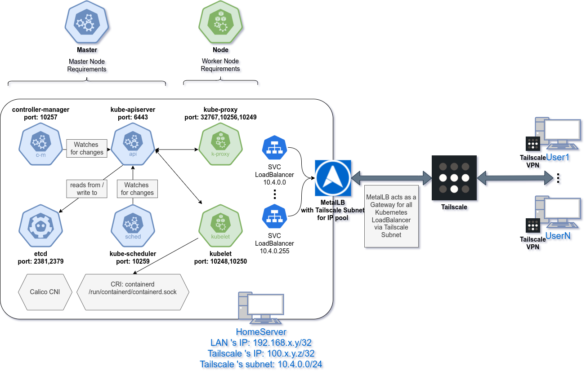
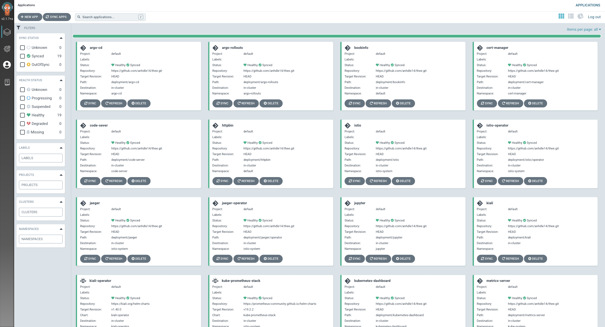

# THE Enterprise (THEE)

A simple model for setting up an Enterprise architecture locally using:

- [x] Argo Projects (argo-cd, argo-rollouts)
- [x] Service Mesh – Istio
- [x] Let's encrypt with Cert Manager
- [x] Observability with (kube-prometheus-stack, Kiali & jaeger)
- [x] Kubernetes with Kubernetes Dashboard and metrics-server
- [x] Remote development (Jupyter Notebook & `code-server`)
- [ ] Kubeflow
- [x] SealedSecrets
- [x] Mordern CI/CD inside Kubernetes with [tektoncd]()
- [x] Access the Kubernetes services everywhere privately with Tailscale VPN

All of this can be setup with GitOps via ArgoCD.

> NOTE: `jupyter labs` and `code-server` are deployed externally because I like to use native terminal emulator, but you could easily use `gitpod` or `code-server` and `jupyter` is the same story as well.

## Architecture

And all of these are managed automatically via ArgoCD with GitOps:

## Getting Started

> Checkout the [Makefile](Makefile) for all installation.
